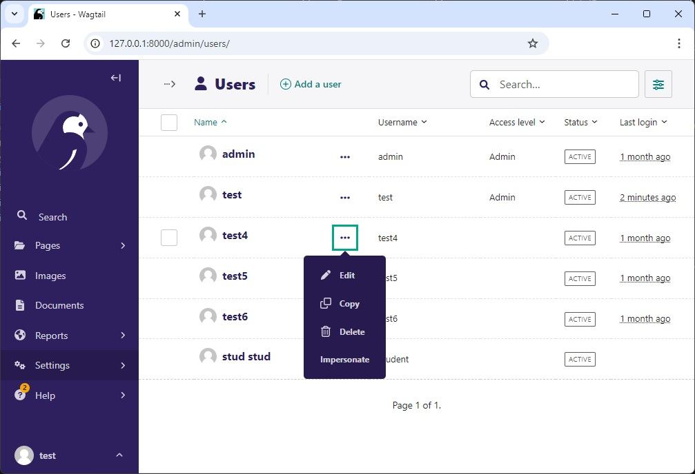
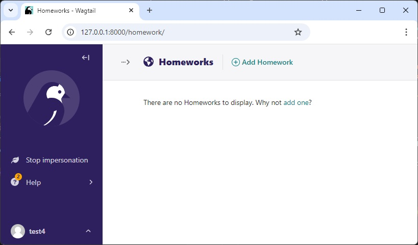

# wagtail-impersonate

[](https://pypi.org/project/wagtail-impersonate/)

Wagtail extension to allow superusers to "impersonate" other accounts within the Wagtail admin interface.

**Version:** 0.1.0  
**Author:** [Stepan Pliaskin](https://plyask.in/)

## Overview

`wagtail-impersonate` is a Wagtail-specific extension built on top of [django-impersonate](https://code.netlandish.com/~petersanchez/django-impersonate/). It enables superusers to impersonate other users, making it easier to debug and troubleshoot user-specific issues or permissions.

To configure `wagtail-impersonate`, you **must first configure `django-impersonate`**. This extension relies on the underlying functionality provided by `django-impersonate`, so it's essential to follow its setup instructions for proper integration.

Please refer to the [django-impersonate documentation](https://code.netlandish.com/~petersanchez/django-impersonate/) for more details on how to configure it correctly.

## Dependencies

- **Wagtail** 6.1 and newer
- **django-impersonate** 1.9.4 and newer

## Installation

Install via pip:

```bash
pip install wagtail-impersonate
```

## Configuration

1. Add `impersonate` and `wagtail_impersonate` to your `INSTALLED_APPS`:

    ```python
    INSTALLED_APPS = [
        ...
        'impersonate',
        'wagtail_impersonate',
        ...
    ]
    ```

2. Add the `ImpersonateMiddleware` to your `MIDDLEWARE` setting **after** the `django.contrib.auth.*` middleware:

    ```python
    MIDDLEWARE = [
        ...
        'django.contrib.auth.middleware.AuthenticationMiddleware',
        'impersonate.middleware.ImpersonateMiddleware',
        ...
    ]
    ```

3. Add the `impersonate` URLs to your project's URL configuration:

    ```python
    from django.urls import path, include

    urlpatterns = [
        path("admin/", include(wagtailadmin_urls)),
        path("impersonate/", include('impersonate.urls')),
        # other urls...
    ]
    ```

## Functionality

To use the impersonation feature:

1. Navigate to **Settings** -> **Users** in the Wagtail admin.
2. Locate the user you wish to impersonate, click on the three dots next to their name (More options), and select the **Impersonate** button.

To stop impersonating, click the **Stop Impersonation** button in the admin sidebar.

### Superuser Mode


### Impersonation Mode


## Important Settings

As `wagtail-impersonate` is a wrapper around `django-impersonate`, you need to configure certain settings in `settings.py` as per the [django-impersonate README](https://code.netlandish.com/~petersanchez/django-impersonate/).

Here are some key settings to pay attention to:

```python
IMPERSONATE = {
    "URI_EXCLUSIONS": [],  # URIs where impersonation should be disabled
    "REDIRECT_FIELD_NAME": "next",  # URL parameter to redirect after impersonation
    "REDIRECT_URL": "/",  # Default redirect after impersonation ends
}
```

Please refer to the [django-impersonate documentation](https://code.netlandish.com/~petersanchez/django-impersonate/) for a complete list of configuration options.

## License

This project is licensed under the MIT License. See the LICENSE file for details.
